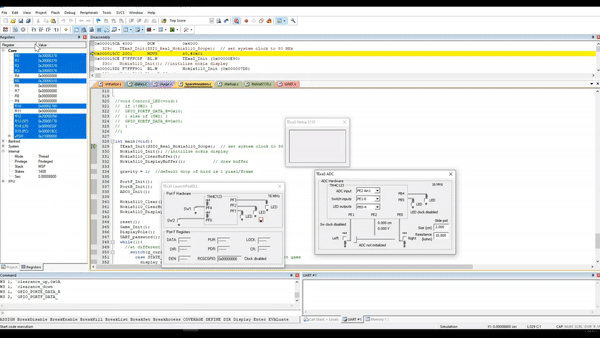

# Flappy Bird on Tiva C Microcontroller 
MSE 450 (Real-time Embedded Control Systems) project. Completed with Syed Salman and Peter Kwan 

## Team Members
- Alzaib Karovalia
- Peter Kwan
- Syed Salman Haider

## Demo

## Required files
- SpaceInvaders.c (main)
- startup.s
- Nokia5110.c
- Nokia5110.h
- random.s
- random.h
- tm4c123gh6pm.h
- TExaS.c
- TExaS.h
- stdbool.h
- stdlib.h
- ADC.c
- ADC.h
- UART.c
- UART.h
- image.c
- image.h
- initialize.c
- initialize.h

## I/O used
- SW2 from TExaS PortF (switch)
- PE0 from TExaS ADC (switch)
- PB4 & PB5 from TExaS ADC (LED)
- PE2 from TExaS ADC (ADC slider)
- Nokia 5110 from TExaS Nokia

## Steps
- ensure debug option is set to "-pCM4 -dLaunchPadDLL"
- ensure debug mode window updates periodically.
- ensure UART window is opened
- ensure TExaS Nokia, PortF, ADC are all opened

1. enter debug mode and run
2. enter password in UART (password is awesome) to process to turning on screen
3. When in start screen, click SW2 on TexaS PortF (optional to leave it click or unclick)
4. When game starts (PB4 will be lighten), click PE0 in TExaS ADC to move bird upwards (PE0 automatically unclicks)
5. Slide the ADC PE2 slider to control the bird drop speed. There are 3 sections: 
   left = slow(easy)
   middle = medium(medium) 
   right = fast(hard)
6. When scored PB5 will be lighten
7. When bird hits, game will show score and reset to start screen.
8. Press SW2 to start again (not needed if SW2 is left clicked from step 3)

## Images
### Logo

### Start Screen

### Game Screen 

### Hit Screen 

### End Screen

